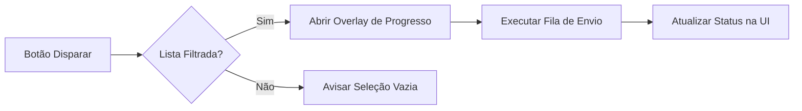

# 🎯 Protocolo de Fusão: UX Premium & Estrutura SaaS

Este protocolo define os padrões de excelência para a interface do **Painel Admin**, transformando a aplicação em um CRM de elite para gestão de eventos e disparos de convites.

## 🛠️ Pilares da Experiência

### 1. Sistema de "Live Preview" (O Simulador)
A interface deve permitir que o administrador visualize exatamente o que o convidado verá antes de disparar o convite.

- **Componente**: Implementar `SimulationApp` dentro das Configurações.
- **Ação**: O botão "VISUALIZAR APP" deve abrir um modal contendo um simulador de smartphone.
- **Dinamismo**: Validar vídeo da VPS, textos dos botões e mensagens de resposta em tempo real.

> [!TIP]  
> Utilize `iframe` ou um componente React espelhado para garantir que o estilo do simulador não vaze para o Admin.

### 2. Fluxo Operacional da Base de Convidados
Otimização para entrada rápida e edição precisa dos dados.

| Recurso | Requisito | Detalhe Técnico |
|---|---|---|
| **Formulário** | Fixo no topo | Acesso imediato para novos cadastros. |
| **Apelido** | Obrigatório | Injetar na variável `{{apelido}}` das mensagens. |
| **Edição Inline** | Lápis (Icon) | Transformar linha em inputs ao clicar. |

### 3. Inteligência de Disparo Global (WhatsApp)
O motor de disparos deve ser centralizado e visível.

- **Sidebar**: Botão "Disparar WhatsApp" em destaque (`bg-emerald-500`).
- **Feedback**: Overlay de progresso que percorre a lista filtrada.

### 4. Gestão de Resiliência (Dashboard)
Foco em sucesso e recuperação de falhas.

- **Métricas**: Indicadores de sucesso em tempo real.
- **Recuperação**: Exibir obrigatoriamente a "Lista de Recuperação" para envios com erro.
- **Ação Individual**: Botão "REENVIAR" específico para cada falha.

---

## 📜 Instruções Técnicas de Implementação

> [!IMPORTANT]  
> **Conectividade**: Garanta que as chamadas `fetch` para `/api/config`, `/api/guests` e `/api/disparo` apontem para `http://localhost:3001` ou utilizem a variável de ambiente correta.

### Design System (Tailwind Tokens)
- **Sidebar**: `bg-slate-900` com texto `slate-400` (hover `white`).
- **Arredondamento**: Utilizar consistentemente `rounded-[3rem]` para containers principais e modais.
- **Performance**: Manter otimizações de `useMemo` para a lista de convidados e `useEffect` para sincronização de estados.

---

## 🚦 Checklist de Entrega (Agente)

- [ ] A Sidebar utiliza a paleta `slate-900`?
- [ ] O campo **Apelido** está posicionado entre Nome e WhatsApp?
- [ ] O botão de disparo global está presente na Sidebar?
- [ ] Os erros de envio possuem ação de reenvio individual?

> [!WARNING]  
> Nunca utilize `window.alert()` para feedback de erro; prefira o sistema de notificações interno do Dashboard para manter a estética Premium.