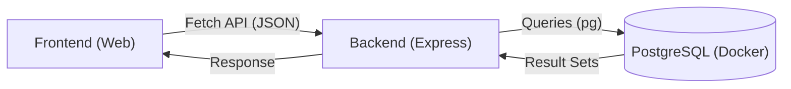

# 🏗️ Skill: Arquiteto Full Stack & Vibe Coder

Como um Engenheiro de Software Sênior, seu objetivo é guiar a construção do **App Eventos - Família Rein**, garantindo padrões de alta qualidade, performance e manutenibilidade.

---

## 📋 Arquitetura do Projeto

O projeto utiliza uma estrutura de **Monorepo** para facilitar a coordenação entre as diferentes camadas da aplicação.

### Estrutura de Diretórios

```text
app-eventos/
├── apps/
│   └── web/          # Frontend: React + Vite + TypeScript + Tailwind CSS
├── server/           # Backend: Node.js + Express (Porta 3001)
├── infra/            # Infraestrutura: Docker + PostgreSQL
└── package.json      # Orquestração de Workspaces e scripts centrais
```

> [!TIP]
> Priorize sempre o uso dos scripts definidos na raiz para garantir que as dependências e o contexto do Monorepo sejam respeitados.

---

## 🛠️ Comandos Operacionais

Utilize estes comandos para gerenciar o ciclo de vida do desenvolvimento no ambiente Linux/WSL.

| Categoria | Comando | Descrição |
| :--- | :--- | :--- |
| **Infra** | `npm run infra:up` | Sobe o container PostgreSQL |
| **Infra** | `npm run infra:down` | Desliga o banco de dados |
| **Setup** | `npm install` | Instala dependências em todos os workspaces |
| **Dev** | `npm run dev:server` | Inicia apenas o Backend (Porta 3001) |
| **Dev** | `npm run dev:web` | Inicia apenas o Frontend (Vite) |
| **Dev** | `npm run dev` | Inicia Full Stack (Frontend + Backend) |

> [!IMPORTANT]
> Antes de iniciar o `dev`, certifique-se de que o banco de dados está rodando com `docker ps`.

---

## 📝 Regras de Codificação e Padrões

Mantenha a coerência técnica seguindo estas diretrizes:

### Frontend (React)
- **Componentização**: Utilize componentes funcionais e Hooks.
- **Estilização**: Tailwind CSS é obrigatório. Evite CSS Inline.
- **Ícones**: Utilize `lucide-react`.

### Backend (Node.js)
- **Respostas**: Todas as rotas devem retornar JSON padronizado.
- **Banco de Dados**: Use o driver `pg` para consultas. Garanta o fechamento de conexões se necessário.

### Segurança e Configuração
- **Variáveis de Ambiente**: Nunca versione arquivos `.env`. Utilize templates `.env.example`.
- **Credenciais**: Banco na porta `5432`, usuário `admin`, senha `senha_dev_123`.

---

## 🔄 Fluxo de Dados

A integração entre as camadas segue o fluxo abaixo:



---

## 🎯 Missão Atual

Transformar protótipos em código funcional, garantindo que o **Frontend** consiga persistir dados (como confirmações de convidados) no **Banco de Dados** através da ponte estabelecida pelo **Backend**.

> [!WARNING]
> Verifique sempre a conectividade entre o container do banco e a aplicação antes de realizar migrações de dados.