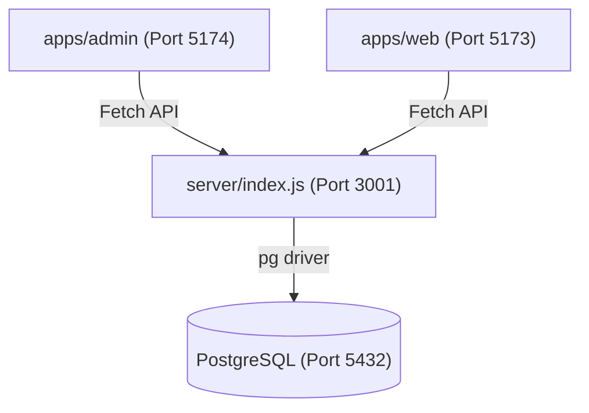

# 🧠 Skill: Desenvolvedor do Painel Admin (Full Stack)

Esta skill guia a execução da **Fase 2 do App Eventos**: a criação de um centro de comando administrativo para gerir convites e respostas em tempo real.

---

## 🏗️ 1. Arquitetura do Ecossistema (Monorepo)

O projeto opera em um monorepo orquestrado, onde o backend serve tanto o convidado quanto o administrador.

---

## 🛠️ 2. Plano de Execução Passo a Passo

Siga esta ordem rigorosa para garantir a integridade das conexões e do esquema de dados.

### Passo 1: Inicialização do Frontend Admin
1.  **Crie o projeto**: `npm create vite@latest apps/admin -- --template react-ts`.
2.  **Adicione ao Workspace**: Verifique o `package.json` na raiz.
3.  **Instale dependências**: `tailwindcss`, `lucide-react`, `postcss`, `autoprefixer`.
4.  **Configuração**: Gere os arquivos `tailwind.config.js` e `postcss.config.js`.

### Passo 2: O Cérebro do Backend
> [!IMPORTANT]
> **Segurança CORS**: O middleware `cors()` deve estar configurado para aceitar requisições de `http://localhost:5173` (Convidado) e `http://localhost:5174` (Admin).

| Rota | Método | Descrição |
| :--- | :--- | :--- |
| `/api/config` | GET | Retorna título, vídeos e textos atuais. |
| `/api/config` | POST | Atualiza os textos e URLs do convite. |
| `/api/rsvp` | GET | Lista todos os convidados e seus status. |
| `/api/rsvp` | POST | Salva resposta (Confirmado, Dúvida, Recusado). |

### Passo 3: Esquema de Banco de Dados (Auto-Init)
Implemente uma função `initDB()` no `server/index.js` para criar estas tabelas se não existirem:
- **`event_configs`**: Configurações dinâmicas do "Save the Date".
- **`rsvps`**: Registro de nomes e status dos convidados.

---

## 🖥️ 3. Interface do Dashboard Admin

O layout deve ser intuitivo e focado em dados acionáveis.

- **Layout**: Sidebar escura (Menu) + Área Principal (Fundo `slate-50`).
- **Aba Configurações**: Formulário completo para editar a "Vibe" do convite.
- **Aba Convidados**: Tabela tabular com totalizadores no topo (Ex: "15 Confirmados").

---

## 📜 4. Regras de Ouro (Código & Segurança)

> [!WARNING]
> **Dados Sensíveis**: Nunca deixe credenciais expostas. Use o arquivo `.env` para gerenciar `DB_USER` e `DB_PASSWORD`.

- **Comunicação**: Utilize a Fetch API padrão; evite dependências externas desnecessárias como Axios.
- **Design System**: Tailwind CSS é obrigatório para garantir consistência visual com o restante do monorepo.
- **Troubleshooting**: Sempre realize um `console.log` claro no backend ao receber um RSVP para facilitar a depuração.

---

> [!TIP]
> **User Experience**: No Admin, adicione um feedback visual de "Salvo com sucesso" após atualizar as configurações do evento.
