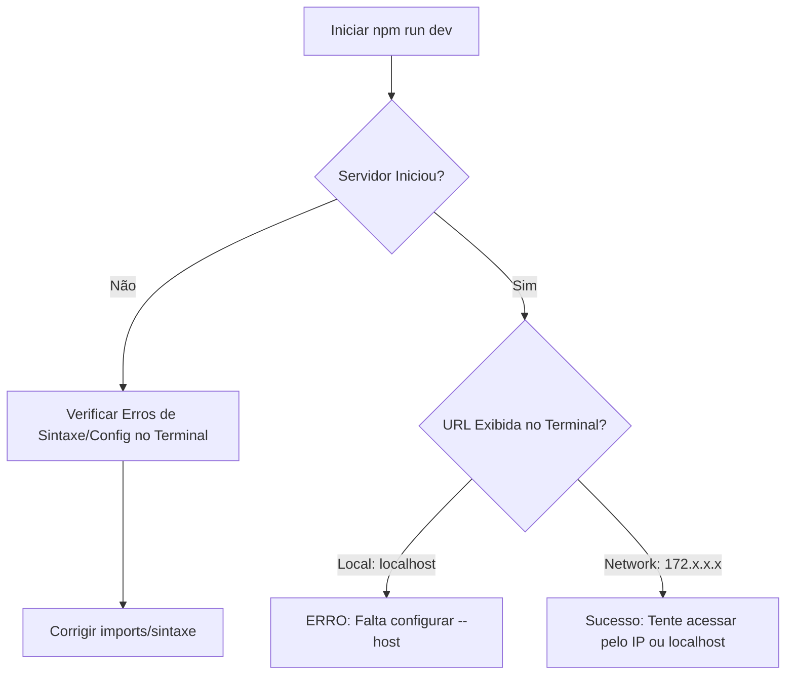

# 🛠️ Skill: Solucionador de Problemas de Conexão (Vite/WSL)

Esta skill fornece um pipeline rigoroso para diagnosticar e resolver falhas de rede entre o host Windows e o ambiente WSL ao utilizar o servidor de desenvolvimento do Vite.

## 🔍 Contexto do Problema

O erro `ERR_CONNECTION_REFUSED` no navegador geralmente indica que o processo do Vite não está a escutar na rede externa (host 0.0.0.0) ou que a porta foi redirecionada incorretamente no WSL2.

---

## 🚀 Plano de Execução

### Passo 1: Configuração de Rede do Vite

No WSL, o servidor deve ser exposto explicitamente para a rede.

> [!IMPORTANT]  
> A propriedade `server.host: true` é mandatória para que o Windows consiga "ver" a porta aberta dentro do Linux.

#### [MODIFY] `vite.config.ts` (ou `.js`)
Certifique-se de que o bloco `server` está configurado como abaixo:

```typescript
import { defineConfig } from 'vite'
import react from '@vitejs/plugin-react'

export default defineConfig({
  plugins: [react()],
  server: {
    host: true,       // Expõe o servidor para a rede local (0.0.0.0)
    port: 5173,       // Porta preferencial
    strictPort: false // Tenta 5174 se a 5173 estiver em uso
  }
})
```

### Passo 2: Limpeza e Redepreciação
Casos de cache corrompida podem impedir o build silenciosamente.

1. Navegue até a pasta da app (`apps/admin` ou `apps/web`).
2. Remova a cache do Vite: `rm -rf node_modules/.vite`.
3. Reinstale as dependências: `npm install`.

### Passo 3: Fluxo de Diagnóstico



---

## 📋 Matriz de Opções do Servidor Vite

| Opção | Valor | Justificativa |
|---|---|---|
| `host` | `true` | Necessário para permitir tráfego entre WSL e Windows. |
| `port` | `5173` | Porta padrão, deve coincidir com o redirecionamento. |
| `strictPort` | `false` | Evita falha crítica caso outra instância esteja rodando. |

---

## 🚦 Checklist de Verificação

- [ ] O terminal exibe a linha `➜  Network: http://172.x.x.x:5173/`?
- [ ] O arquivo `package.json` da raiz aponta corretamente para o workspace? (Ex: `npm run dev --workspace=apps/admin`)
- [ ] O backend (Porta 3001) está rodando simultaneamente?

> [!TIP]  
> Se o problema persistir mesmo com `host: true`, verifique as regras de Firewall do Windows ou tente rodar `wsl --shutdown` no PowerShell do Windows para resetar a rede virtual.
