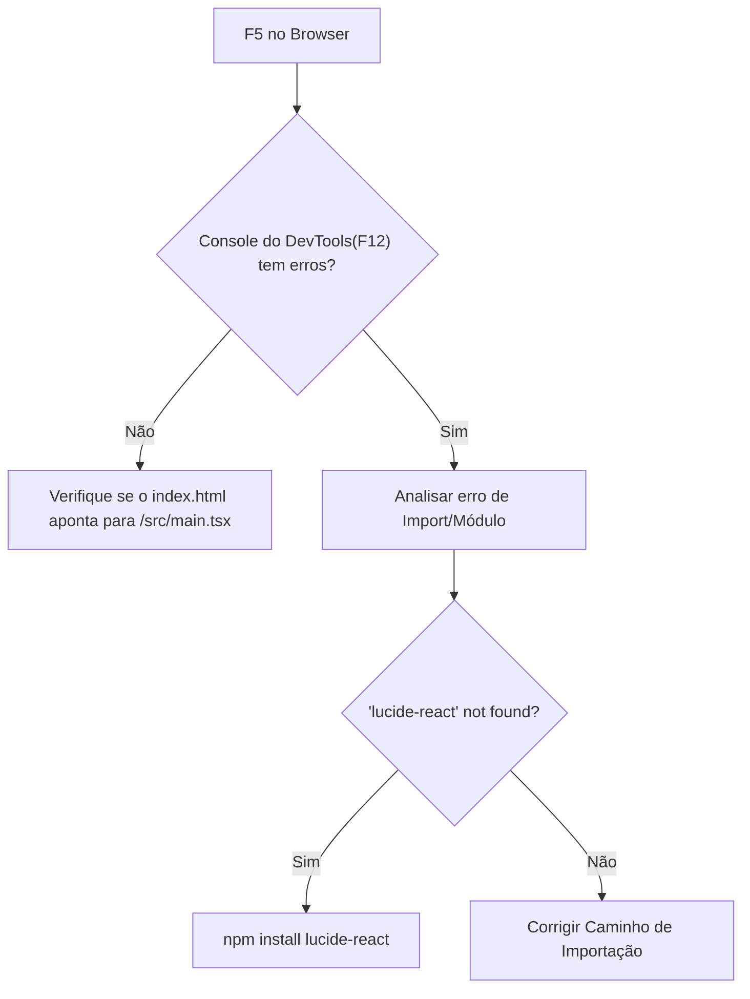

# 🚑 Skill: Caçador de Tela Branca (React/Vite)

Esta skill fornece um protocolo de emergência para quando o servidor Vite está online, mas a aplicação falha em renderizar no navegador, apresentando apenas um fundo vazio.

## 🔍 Contexto do Problema

A "Tela Branca" geralmente ocorre devido a:
1.  **Erros de Importação**: Referências a arquivos inexistentes ou mal nomeados.
2.  **Entry Point Corrompido**: O `index.html` não aponta para o script correto ou o `#root` está ausente.
3.  **Dependências de UI**: Ícones (ex: `lucide-react`) ou estilos não instalados que travam a execução do motor React.

---

## 🚀 Protocolo de Recuperação

### Passo 1: Validação do Entry Point HTML
O Vite requer um link direto e absoluto para o módulo de entrada dentro do `index.html`.

> [!IMPORTANT]  
> Garanta que o `<div id="root"></div>` está presente e posicionado ANTES da tag `<script>`.

#### [REPLACE] `apps/admin/index.html`
```html
<!DOCTYPE html>
<html lang="pt-br">
  <head>
    <meta charset="UTF-8" />
    <meta name="viewport" content="width=device-width, initial-scale=1.0" />
    <title>Admin - App Eventos</title>
  </head>
  <body>
    <div id="root"></div>
    <script type="module" src="/src/main.tsx"></script>
  </body>
</html>
```

### Passo 2: Estabilidade do Motor React (`main.tsx`)
Muitas vezes, falhas silenciosas ocorrem por erros de tipagem ou mounts incorretos.

#### [REPLACE] `apps/admin/src/main.tsx`
```typescript
import React from 'react'
import ReactDOM from 'react-dom/client'
import App from './App'
import './index.css'

const rootElement = document.getElementById('root');
if (!rootElement) throw new Error('Failed to find the root element');

ReactDOM.createRoot(rootElement).render(
  <React.StrictMode>
    <App />
  </React.StrictMode>,
)
```

### Passo 3: Fluxo de Troubleshooting



---

## 📋 Matriz de Dependências Críticas

| Pacote | Função | Comando de Instalação |
|---|---|---|
| `lucide-react` | Ícones do Dashboard | `npm install lucide-react` |
| `tailwindcss` | Estilização Global | `npm install -D tailwindcss` |
| `postcss` | Pré-processamento | `npm install -D postcss` |

---

## 🚦 Checklist de Sucesso

- [ ] Executou `npm install` na pasta da aplicação?
- [ ] O arquivo `index.css` contém as diretivas `@tailwind`?
- [ ] O console do navegador está limpo de erros vermelhos?

> [!TIP]  
> Se após tudo isto a tela continuar branca, tente remover a pasta `.vite` dentro de `node_modules` e reinicie o servidor: `rm -rf node_modules/.vite`.