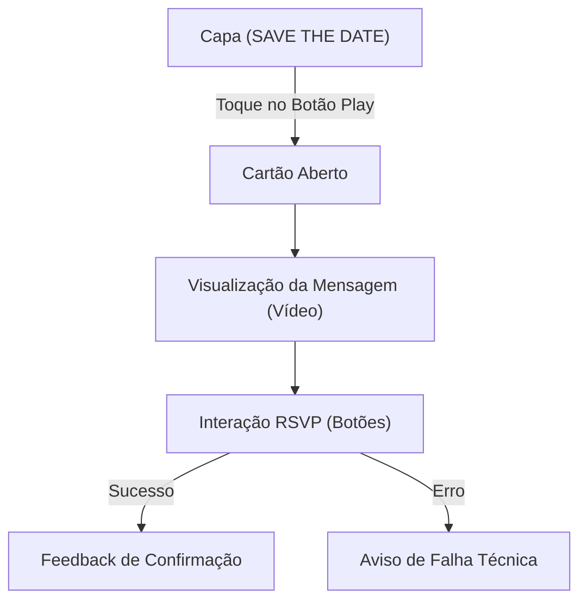

# 📅 Plano Mestre: App Eventos Família Rein (v2)

Este documento atua como o **Guia Supremo de Execução** para o desenvolvimento do ecossistema de eventos. Ele deve ser utilizado por agentes de IA para garantir a fidelidade entre o design visual, a experiência do utilizador e a persistência de dados.

---

## 🎯 1. Visão Geral e Missão

A missão é criar um convite digital de alto impacto ("Save the Date") que transite suavemente de uma experiência estética de "capa" para um cartão interativo com formulários de confirmação (RSVP) integrados ao banco de dados PostgreSQL.

> [!IMPORTANT]
> **Paradigma Vibe Coder**: O código deve priorizar animações suaves via Tailwind e ícones elegantes via Lucide-React. A experiência deve ser "Premium" e "Digital-First".

---

## 🎨 2. Mapeamento de Estados da UI

A aplicação deve gerir dois estados principais de navegação interna:

### 📥 2.1. Estado: Capa (Início)
- **Gatilho**: `!iniciado`
- **Elementos**: Título "SAVE THE DATE" (font-extralight, tracking-widest), convite para interação.
- **Ação**: Botão central "Play" que ativa o estado iniciado.

### 📤 2.2. Estado: Cartão Aberto
- **Gatilho**: `iniciado`
- **Elementos**:
    - Placeholder de Vídeo/Mensagem da família.
    - Área de confirmação (RSVP) com botões coloridos (Confirmar, Dúvida, Não Ir).
    - Rodapé institucional `familia-rein.cloud`.

---

## 🔄 3. Fluxo de Decisão e Navegação

---

## 🛠️ 4. Stack Tecnológica e Requisitos

| Camada | Tecnologia | Requisito Crítico |
|---|---|---|
| **Frontend** | React + TypeScript | Uso de `useState` para controle de estados e `animate-in` para transições. |
| **Styling** | Tailwind CSS | Utilizar paleta `bg-slate-900` e `text-white`. |
| **Backend** | Node.js (Express) | Rota `/api/confirmar` pronta para receber JSON. |
| **Database** | PostgreSQL | Tabela `confirmacoes` para registro imutável do RSVP. |

---

## 🚀 5. Diretrizes de Execução (Skills do Agente)

> [!TIP]
> **Animações**: Utilize classes como `animate-pulse` no texto de ajuda da capa e `zoom-in` ao abrir o cartão para elevar a percepção de qualidade.

1.  **Crie primeiro a estrutura de estados** no React antes de estilizar.
2.  **Valide a conexão com a API** de forma assíncrona, exibindo estados de "carregamento" ou "sucesso".
3.  **Não versione o .env**: Utilize sempre as variáveis de ambiente mapeadas no `arquiteto_full_stack.md`.

---

## 🔍 6. Troubleshooting

- **O convite não abre**: Verifique se a variável `iniciado` está sendo alterada corretamente pelo botão da capa.
- **A confirmação falha**: Valide se o backend está rodando no porto `3001` (conforme o Monorepo) e se o proxy do Vite está ativo.
- **Alinhamento visual**: Garanta que o container principal use `flex flex-col items-center justify-center min-h-screen`.

---

> [!WARNING]
> **Consistência de Dados**: Garanta que o nome do convidado seja validado no frontend antes do envio para o banco para evitar registros vazios.