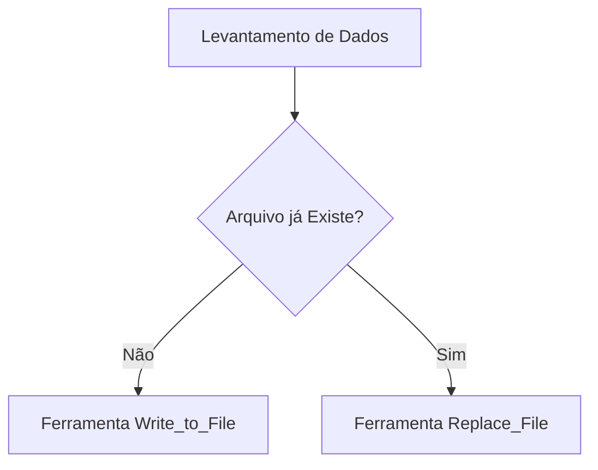

# 🛠️ Guia: Melhores Práticas para Agentes Criarem Skills

Este guia consolida regras vitais, formatação ideal e diretrizes arquitetônicas que um agente de inteligência artificial deve seguir ao gerar novos arquivos de conhecimento e workflows, conhecidos como "Skills".

## 📋 Arquitetura e Estrutura de Diretórios

As Skills destinam-se a estender as capacidades de resolução de problemas e padronização. Se uma skill envolve lógicas extensas e auxiliares externos, estruture em diretórios:

```text
nome-da-skill/
├── SKILL.md         # (Obrigatório) Instruções centrais com YAML frontmatter. O agente LERÁ este arquivo primeiro.
├── scripts/         # Lógicas repetitivas refatoradas (Scripts Python, Bash, Node).
├── examples/        # Exemplos práticos do sucesso esperado.
└── resources/       # Referências, JSONs ou templates estáticos necessários.
```

> [!NOTE]  
> Em casos mais genéricos ou teóricos, onde não há necessidade de ferramentas e executáveis, um único arquivo `.md` basta. Porém, ele deve conter a formatação rica apropriada.

---

## 📝 Formatação Central do SKILL.md

Um arquivo bem construído maximiza as ações do agente, eliminando ambiguidades e evitando loops infinitos de "dúvidas". É vital estruturar a documentação de maneira inteligível para o contexto sistêmico da IA.

### 1. YAML Frontmatter OBRIGATÓRIO
Todo SKILL deve inicializar com metadados YAML antes do Markdown para garantir sua correta catalogação:

```yaml
---
name: [Nome da Skill - slug, curtos]
description: [Resumo claro de 1 a 2 linhas com a missão primária e os gatilhos para acionamento dessa skill]
---
```

### 2. Estilo de Escrita e Pragmatismo
- **Abordagem Imperativa**: Utilize "Crie", Diga", "Não execute". Comandos diretos otimizam a execução da IA subjacente.
- **Clareza de Escopo**: Defina o que a skill resolve, mas tão importante quanto, **o que ela não deve tentar resolver**.

### 3. Alertas Estratégicos (Estilo GitHub)
Os agentes priorizam semanticamente dados inseridos dentro de painéis de "Alertas". Utilize isso para garantir que a IA não pule validações essenciais:

```markdown
> [!IMPORTANT]  
> Utilizar esta flag de alerta garante que o agente verificará este requisito de segurança vital, agindo como barreira de segurança em manipulações críticas.

> [!WARNING]  
> Avisa sobre potenciais Breaking Changes na infraestrutura atual que requer bypass ou atenção.

> [!TIP]  
> Sugere atalhos e best-practices para performance sem exigir que o agente force este comportamento, apenas como conselho.
```

### 4. Blocos de Código e Diffs de Referência
Sempre defina a linguagem do `<code_block>`. Para alterações em sistemas prévios, adote o estilo Diff.

```diff
-  funcaoDescontinuada()
+  novaEstrategia()
```

### 5. Diagramas Lógicos (Mermaid)
Fluxos complexos, interações entre microsserviços ou tomadas de decisão compostas são assimilados melhor se ilustrados como fluxogramas do `Mermaid`.
> Garanta que nos nomes dos nós (labels) os caracteres de escape ou aspas duplas constem caso você adicione colchetes pu parênteses de texto.



### 6. Tabelas (Informações Multidimensionais)
O formato de tabela diminui as alucinações e favorece cruzamento de contexto por IAs quando há uma matriz comparativa:

| Ferramenta (Ação) | Opcional/Critico | Justificativa |
|---|---|---|
| `codebase_search` | Opcional | Descobrir diretórios correlatos rapidamente |
| `run_command` | Critico | Usar com restrições e nunca executar deletes silenciosamente |

---

## 🚦 Checklist do Agente ao Fazer Deploy de uma Nova Skill

1. **Cabeçalhos Formados**: O `.md` exibe `.yaml` no seu início?
2. **Dependência Linear**: Eu escrevi "Leia isso primeiro", "Depois faça aquilo"? Se existem dependências, adicionei a lista em ordem.
3. **Escopo Limpo**: Eu transferi os "códigos repetidos" longos para a subpasta `scripts/` em vez de enfiar blocos com 400 linhas no `.md`?
4. **Modos de Falha Incluídos**: Dediquei uma sessão de "Troubleshooting" detalhando para onde eu como agente devo olhar (`logs` ou `catch`) caso a pipeline base ensinada na skill falhe?
5. **Verificação de Caminhos**. Adicionei instruções sobre a preferência na hora de utilizar caminhos e uris das aplicações (Ex: sempre dar match e priorizar links relativos à raiz do Workspace)?

Seguindo essas implementações detalhadamente, os futuros Agentes que herdarem essa Skill trabalharão sobre um pipeline otimizado, veloz, claro e autônomo, agindo assertivamente sem precisarem perturbar o `USER` com interrupções bobas.
